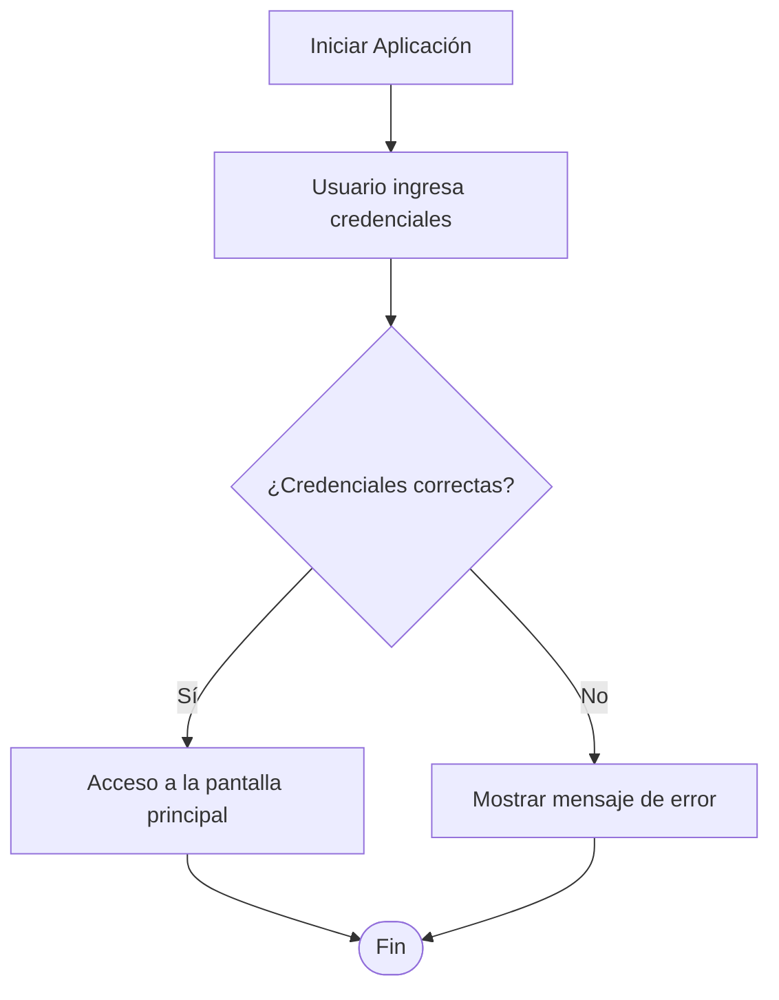
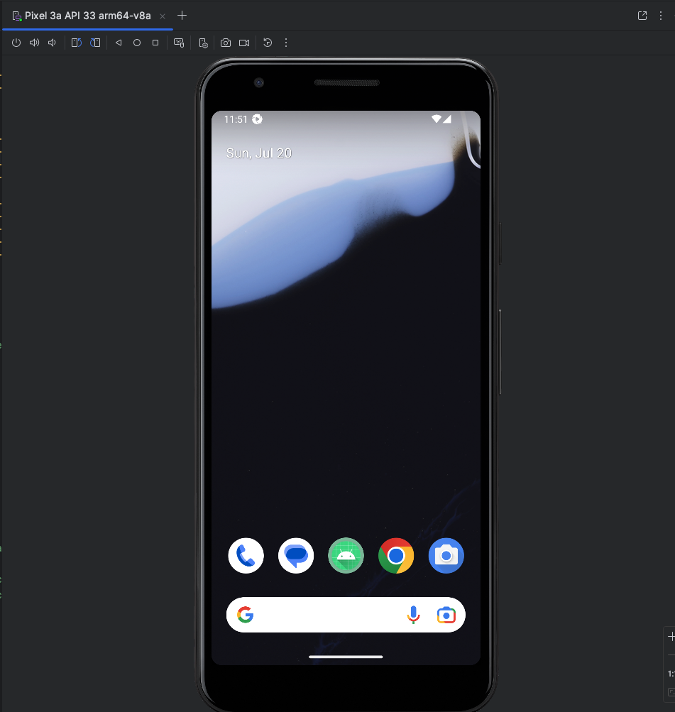
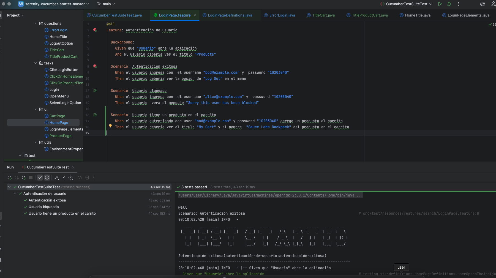
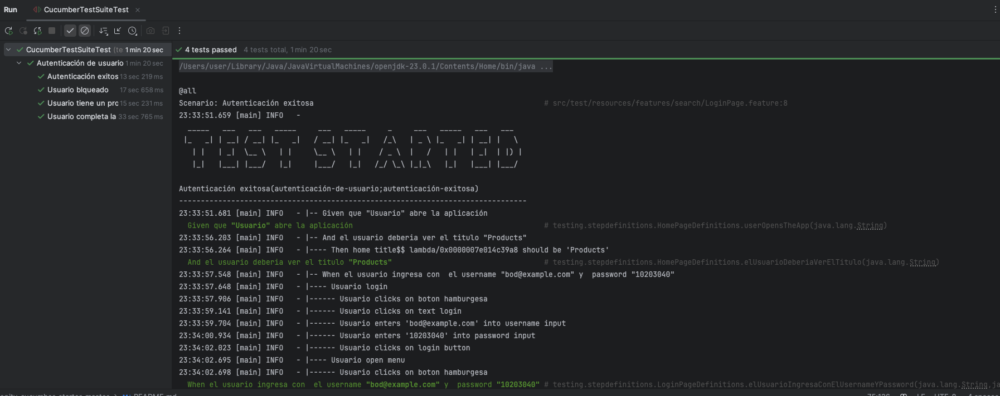
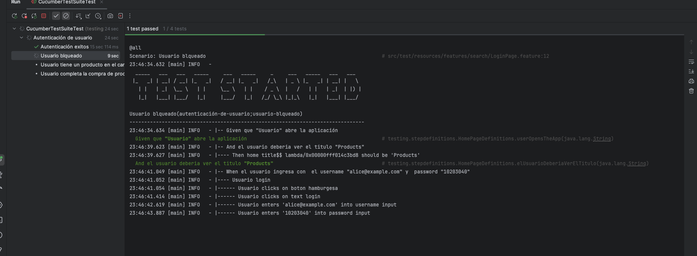
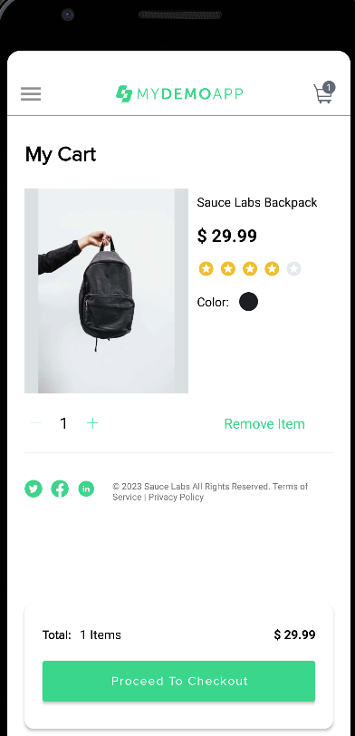
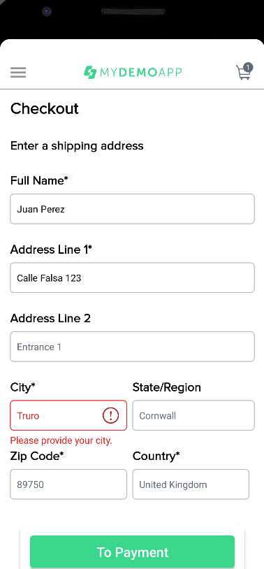
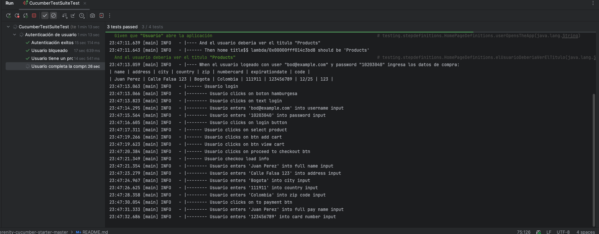

# Serenity BDD Cucumber - Plantilla para Pruebas Móviles

Este proyecto es una plantilla de inicio (starter) para crear pruebas de aceptación automatizadas para **aplicaciones móviles Android**, utilizando Serenity BDD, Cucumber, Appium y Java. Está diseñado para seguir el patrón de diseño Screenplay, que favorece la creación de pruebas más legibles, mantenibles y escalables.

## ¿Para qué es este proyecto?

El objetivo principal de este repositorio es proporcionar una base sólida y bien estructurada para escribir pruebas funcionales automatizadas en dispositivos Android (reales o emulados). Utiliza la metodología BDD (Behavior-Driven Development), donde los casos de prueba se escriben en un lenguaje natural (Gherkin), facilitando la colaboración entre desarrolladores, QAs y stakeholders no técnicos.

Las tecnologías clave utilizadas son:
- **Serenity BDD**: Un framework de reportes que genera documentación viva y detallada sobre los resultados de las pruebas.
- **Cucumber**: Herramienta que interpreta los archivos `.feature` y los ejecuta.
- **Appium**: Servidor de automatización que traduce los comandos a acciones nativas en la UI de Android.
- **Java**: Lenguaje de programación principal.
- **Maven**: Herramienta para la gestión de dependencias y el ciclo de vida del proyecto.
- **Screenplay Pattern**: Un patrón de diseño centrado en el usuario que modela las interacciones del actor con la aplicación.

## Estructura de Carpetas

El proyecto sigue una estructura estándar para facilitar la organización del código de prueba, separando las responsabilidades de manera clara.

```
/src
├───main
│   └───java/testing
│       ├───models/       # Clases (POJOs) que representan entidades de datos.
│       ├───questions/    # Clases para consultar el estado de la app (ej: "¿El título es 'X'?").
│       ├───tasks/        # Clases que representan las acciones que un actor realiza (ej: "Iniciar sesión").
│       ├───ui/           # Clases que definen los localizadores de elementos de las pantallas (Screen Objects).
│       └───utils/        # Clases de utilidad, como la gestión de propiedades de entorno.
│
└───test
    ├───java/testing
    │   ├───runners/      # Clases que ejecutan las pruebas de Cucumber.
    │   └───stepdefinitions/ # "Código pegamento" que conecta los pasos de Gherkin con las Tasks y Questions.
    │
    └───resources
        └───features/     # Archivos .feature que describen los escenarios de prueba.
```

- **`pom.xml`**: Define las dependencias del proyecto (Serenity, Cucumber, Appium, etc.) y los plugins de Maven.
- **`serenity.conf`**: Archivo de configuración principal de Serenity, donde se definen las *capabilities* de Appium (nombre del dispositivo, versión de Android, ruta del `.apk`, etc.) y otras configuraciones.
- **`browserstack.yml`**: Archivo de configuración para ejecutar las pruebas en la nube de BrowserStack.

## ¿Cómo ejecutar las pruebas?

Para ejecutar las pruebas, necesitas tener un servidor de Appium corriendo o un servicio en la nube como BrowserStack configurado en `serenity.conf`.

Una vez configurado el entorno, puedes usar el siguiente comando de Maven:

```bash
mvn clean verify
```

Esto compilará el código, ejecutará las pruebas y generará los reportes de Serenity en la carpeta `target/site/serenity`.

## Diagrama de Flujo (Ejemplo)

A continuación se muestra un diagrama de flujo que ejemplifica una interacción de login en la aplicación.



Este diagrama representa el flujo básico que las pruebas de login automatizadas verificarían.

## Requisitos Previos Para Ejecutar el Proyecto

```bash
appium --allow-insecure chromedriver_autodownload
```
> Referencia: [Cómo automatizar tus pruebas de aplicaciones IOS y Android con Appium](https://www.youtube.com/watch?v=xlVNKM8SncM)

Inicializar manualmente  el virtual device (emulador) de Android:



y Ejecutar las pruebas ya se por codigo o desde el IDE.


## Capturas de Pantalla

---------------------------

---------------------------

---------------------------

---------------------------

---------------------------

---------------------------

---------------------------

